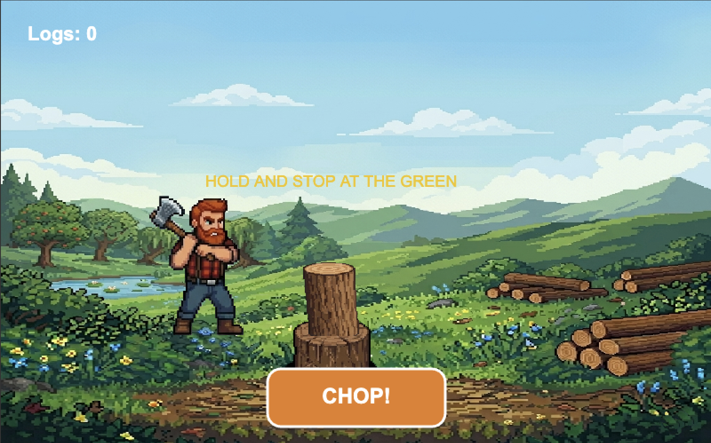

# Lumberjack Chop


A fast-paced, hyper-casual arcade game built from scratch using **TypeScript** and **HTML5 Canvas**. Test your reflexes and master the perfect swing!

⚡ **[Play the Live Demo Here!](https://johannesl2.github.io/ts-html5-lumberjack-game/)**

---

## Gameplay & Mechanics
The core mechanic relies on a classic **Hyper-casual Power Meter**. 
* **The Goal:** Press and hold to charge your chopping power, and release it at the exact right micro-second to hit the **Green Zone**.
* **Controls:** * 💻 **Desktop:** Hold & Release `SPACEBAR` or click the on-screen button with your mouse.
* 📱 **Mobile:** Tap & Hold the responsive on-screen **CHOP** button.

---



## Features & Tech Stack
* **Vanilla TypeScript & HTML5 Canvas** – 100% custom rendering loop, no heavy external game engines.
* **Cross-Platform Input Handling** – Seamlessly unified event listeners for Keyboards (`keydown`/`keyup`), Mice (`mousedown`/`mouseup`), and Mobile Touchscreens (`touchstart`/`touchend`).
* **Responsive Scaling** – Automatic pointer coordinate recalculation to ensure the touch button works perfectly on any screen resolution.
* **Pixel Art Optimization** – Forced crisp rendering flags to keep that retro, jagged pixel aesthetic on modern high-DPI smartphone displays.

---

## How to Run Locally

1. Clone the repository:
   ```bash
   git clone [https://github.com/JohannesL2/ts-html5-lumberjack-game.git](https://github.com/JohannesL2/ts-html5-lumberjack-game.git)
   ```

2. Compile the TypeScript code (and watch for changes):

    ```bash
    tsc game.ts --target es6 --watch
    ```

3. Open index.html directly in your browser or use a local server (like Live Server in VS Code) to play!